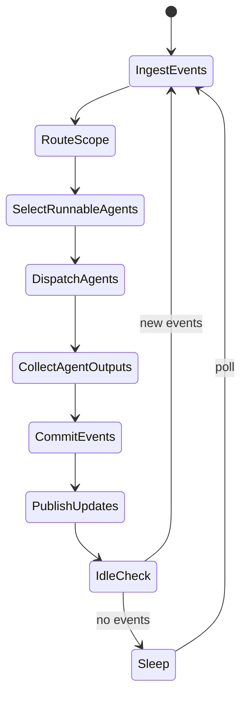
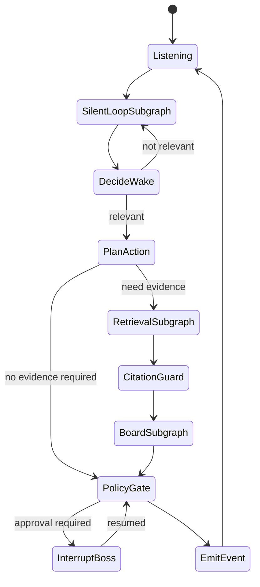

# 02 状态机蓝图与子图演进

## 1. WorldGraph 蓝图

## 2. AgentGraph 蓝图

## 3. 子图就绪设计（每个状态默认可演进）

所有状态都按两种实现形态设计：

- `inline_node`：当前简单场景，单节点实现。
- `subgraph_ready`：一旦复杂度增长，替换为官方子图，不改上下游接口。

这要求每个状态都定义固定 I/O 契约：

- `input_state_slice`
- `output_state_patch`
- `error_contract`

## 4. 子图候选清单（首批）

- `SilentLoopSubgraph`
  - `poll_new_events`
  - `backoff_control`
  - `wake_signal_filter`
- `RetrievalSubgraph`
  - `choose_channel`
  - `retrieve_world_history`
  - `ask_peer`
  - `web_search`
  - `file_search`
  - `merge_and_rank_candidates`
- `BoardSubgraph`
  - `read_board`
  - `upsert_board_item`
  - `delete_or_archive_board_item`
- `GovernanceSubgraph`
  - `open_vote`
  - `cast_vote`
  - `close_vote`
  - `dissolve_group`

## 5. LangGraph 官方能力映射（必须遵循）

- 状态路由：`add_conditional_edges(...)`
- 动态并发：`Send(...)`
- 节点跳转与状态更新：`Command(goto=..., update=...)`
- 中断恢复：`interrupt(...)` + `Command(resume=...)`
- 子图：官方 `use-subgraphs` 模式（子图独立编译后挂载）

## 6. 状态演进策略（避免高耦合重构）

状态从节点升级为子图时，固定步骤：

1. 保持原节点函数签名不变。
2. 将原逻辑拆为子图内部节点。
3. 原节点变为“子图适配器”。
4. 全量回归测试通过后，再把适配器内联删除（可选）。

这样可保证迭代中对上层调用透明。

