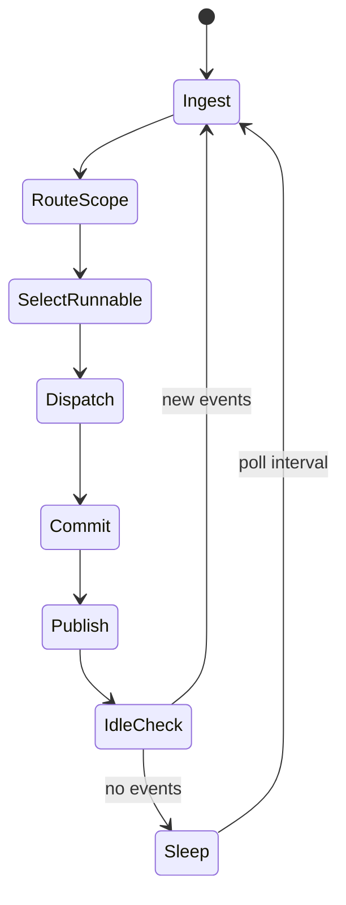
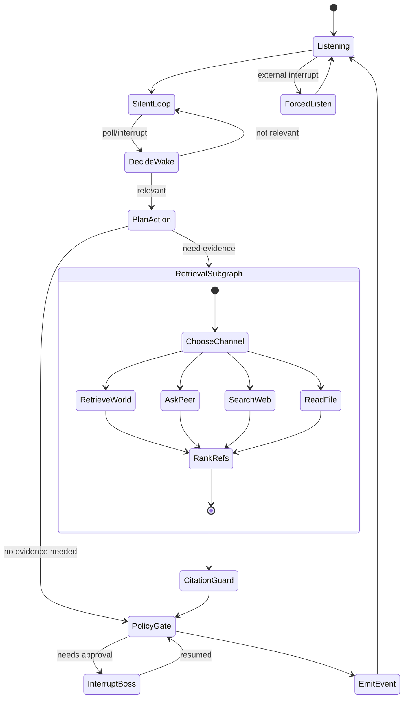

# 02 Agent 独立状态机与世界协作

## 1. 设计目标

你强调的重点是“每个 Agent 不是被总控统一推进，而是独立地等待、倾听、被打断、恢复”。  
因此采用“世界图调度 + 每 Agent 独立图执行”的结构。

这套“Agent 可自主决定是否参与当前轮”的设计是主流可行方案。它属于事件驱动异步多 Agent 模式，前提是三件事到位：

- 有明确动作契约，避免模型任意越界。
- 有唤醒预算和静默上限，避免长期不响应或刷屏。
- 有可观测状态，能定位某个 Agent 为什么沉默或行动。

## 2. WorldGraph 状态机

### 2.1 WorldGraph 关键状态字段

- `world_tick`: 世界时钟。
- `inbox_cursor`: 输入流游标。
- `pending_event_ids`: 待处理事件队列。
- `runnable_agents`: 本轮唤醒的 Agent 列表。
- `main_group_id`: 主群 id（固定存在，默认全员可见）。
- `group_registry`: 小群与成员关系。
- `dm_registry`: 私聊会话索引。
- `boss_pending`: 待 Boss 处理的请求。

### 2.2 WorldGraph 核心职责

- 处理用户/Boss/系统外部输入。
- 按 scope 路由事件可见性（`group:main`/`group:*`/`dm:*`）。
- 决定哪些 Agent 需要被唤醒（不替 Agent 决策具体动作）。
- 并行 dispatch 到 AgentGraph。
- 汇总 Agent 输出并提交事件。

## 3. AgentGraph 状态机（每个 Agent 独立）

`RetrievalSubgraph` 和 `SilentLoop` 就是你说的“小内陷图”。  
LangGraph 里可以把它们做成真正 `subgraph`，也可以先抽象为单节点，后续再细化为子图，不冲突。

工程建议：优先使用 LangGraph 官方子图能力（`use-subgraphs`）实现，而不是手写“伪子图”跳转逻辑。  
这样能直接复用官方的状态隔离、可观测和中断恢复语义，降低后续维护成本。

## 4. “静默/倾听”不是停机，而是低频轮询

这部分是你要求的关键行为：

- `SilentLoop` 并不关闭 LLM，而是低频触发 `DecideWake`。
- 轮询输入只读取“新事件窗口”（例如最近 N 条 + 本 Agent 未见事件）。
- 若判定“无需行动”，再次进入 `SilentLoop`（可指数退避）。

建议参数：

- `idle_poll_sec`: `5 -> 10 -> 20` 秒递增，最大 60。
- `max_silent_rounds`: 连续静默上限，超限后强制做一次轻量回应或状态更新。
- 遇到 `@agent`、`request_specific`、`boss_command` 立即打断退避，强制唤醒。

## 5. Agent 独立状态与线程隔离

每个 Agent 使用独立 `thread_id`：

- `thread_id = <session_id>:agent:<agent_id>`
- checkpointer 存 Agent 状态机推进上下文。
- world 只保存“调度结果”，不侵入 Agent 内部短状态。

这样可以实现：

- A 在 `SilentLoop`，B 在 `SearchWeb`，C 在 `InterruptBoss` 同时并存。
- 单个 Agent 崩溃可恢复，不拖垮整个群聊世界。

## 6. 主群/小群/私聊与协作动作

通过结构化动作触发协作：

- `create_group(name, purpose)`
- `join_group(group_id)`
- `assign_task(group_id, assignee, task)`
- `vote_decision(scope, proposal, options)`
- `dissolve_group(group_id, reason)`

并落地为事件：

- `group_created`
- `group_joined`
- `task_assigned`
- `vote_opened` / `vote_cast` / `vote_closed`
- `group_dissolved`

世界路由器据此动态更新 `group_registry`，并控制后续事件 scope。

## 7. 任务板/记录板作为一等节点

任务板不应只靠“上下文里顺带记住”，建议做成显式节点：

- `board_read_node`: 读取当前任务板/记录板。
- `board_update_node`: 增删改任务项、风险项、已决议项。
- `board_gc_node`: 归档已完成/过期项。

建议事件：

- `board_item_upserted`
- `board_item_deleted`
- `board_snapshot_generated`

## 8. LangGraph 路由建议（关键 API 用法）

### 8.1 `Command(goto=...)` 做状态跳转

- 让 `plan_action` 节点根据动作类型直接跳到执行节点或子图入口。

### 8.2 `Send(...)` 做并行分发

- WorldGraph 将多个可运行 Agent 并发 dispatch 到同一个 worker 节点或子图。

### 8.3 `interrupt(...)` 处理中断

- 风险动作进入 `InterruptBoss` 节点，等待人工输入后恢复。

### 8.4 官方子图能力（推荐）

- 把 `RetrievalSubgraph` 做成可复用官方子图，供多个 Agent/节点复用。
- 把 `SilentLoop` 作为轻量子图封装，避免主图膨胀。
- 子图内部自管局部状态，主图只消费子图输出，保持边界清晰。
- 参考：LangGraph 官方 `use-subgraphs` 文档 https://docs.langchain.com/oss/python/langgraph/use-subgraphs

## 9. 事件驱动打断规则（外部中断）

任一 Agent 收到高优先级事件时，可立即切到 `ForcedListen`：

- `boss_force_listen`
- `session_pause_all`
- `urgent_incident`

这保证“可被打断”是图层特性，而不是提示词期望。
